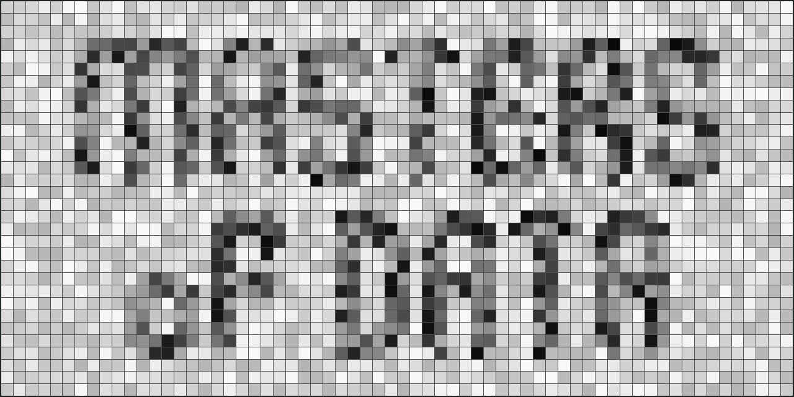

# MASTERS of DATA

Welcome to MASTERS of DATA. A course oriented to **Technical Designers**, **Technical Artists** and any **game developer** that wants to understand and control game data to the last bit.

In this course you will learn to:

 - **Understand your data:** How game data is organized, what is contained in every data file of your game.
 - **Process your data:** Read multiple data files, extract the data you need and edit that data programatically.
 - **Optimize your data:** Reduce size, improve quality, get the best results for every situation and for platform.
 - **Visualize your data:** Create custom tools to display your data: images, audio, text, models... any kind of data.
 - **Protect your data:** Design a custom file format and export your data to it, compress and codify your data.
 - **Automatize processes:** Create custom tools to read/write big bulks of data in batch, define a command-line interface.
 
## UNDERSTANDING GAME DATA

 - Introduction to file formats **[3h]**
 - Data packing: from Header to EOF **[3h]**
 - Basic data compression and protection **[3h]**
 - Image data: from colors to pixels **[3h]**
 - Image data: optimization techniques **[3h]**
 
   - Ex. Reading BMP file (no external libs) **[3h]**
   - Ex. Reading PNG file (no external libs) **[3h]**
   
 - Audio data: from waves to samples **[3h]**
 - Audio data: optimization techniques **[3h]**
 
   - Ex. Reading WAV file (no external libs) **[3h]**
   
 - Text data: from codes to encoding **[3h]**
 - Text data: optimization techniques **[3h]**
 
   - Ex. Reading and writting UTF-8 text **[3h]**
   - Ex. Rendering glyphs from font **[3h]**
   - Ex. Font atlas generation **[3h]**
   
 - Models data: from vertex to bones **[3h]**
 - Models data: optimization techniques **[3h]**
 
   - Ex. Reading OBJ file (no external libs) **[3h]**
   - Ex. Reading IQM skeletal animation data **[3h]**
   - Ex. Writing custom model format **[3h]**
   
 - Packing models data for Data Oriented Design: SoA vs AoS **[3h]**

## VIEWING & PROCESSING GAME DATA

 - Define a custom file format (Ref. RIFF, PNG and ZIP file formats) **[3h]**
 
   - Ex. Writting a custom file format writer **[3h]**
   - Ex. Reading a custom file format **[3h]**
   
 - Visualizing data 101: IMGUI introduction **[3h]**
 - Visualizing data: tools development basis **[3h]**
      
   - Ex. Viewing custom data: Image **[3h]**
   - Ex. Viewing custom data: Audio **[3h]**
   - Ex. Viewing custom data: Text **[3h]**
   - Ex. Viewing custom data: Model **[3h]**
   - Ex. Viewing generic data: HexViewer **[3h]**
   
 - Processing data and optimization **[3h]**
   
   - Ex. Process image data (pixel-formats, filters, combine channels...) **[3h]**
   - Ex. Process audio data (sample rate, sample size, normalize...) **[3h]**
   - Ex. Process model data (optimize vertex attributes) **[3h]**
   - Ex. Process text data (convert text to image) **[3h]**
   - Ex. Process image and text data (steganography) **[3h]**

## AUTOMATIZING PROCESSES

 - File system theory and access **[3h]**
 - Command line file processing **[3h]**
 - GUI and CLI tools development **[3h]**
 - Scripting and Automatization **[3h]**

   - Ex. Image directory batch processing **[3h]**
   - Ex. Data packer: Compression and protection **[3h]**
   - Ex. Data unpacker and viewer **[3h]**
